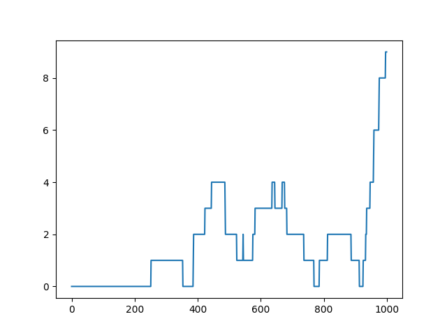

# FrozenLake RL Agent ❄️

This project implements a Reinforcement Learning (Q-Learning) agent to solve the FrozenLake environment from OpenAI Gym.

---

## 📌 Overview

The agent learns to navigate a frozen lake while avoiding holes and reaching the goal. It improves its performance over time using the Q-Learning algorithm.

---

## 📂 Project Structure

```
frozenlake-rl-agent/
├── src/
│   └── train.py
├── results/
│   ├── model.pkl
│   └── reward_plot.png
├── requirements.txt
└── README.md
```

---

## 🚀 How to Run

1. Install dependencies:

```
pip install -r requirements.txt
```

2. Run the training:

```
python src/train.py
```

---

## 📊 Results

* Trained Q-table saved in `results/model.pkl`
* Training performance graph in `results/reward_plot.png`

---

## 🧠 Algorithm Used

* Q-Learning

---

## 🛠 Tech Stack

* Python
* NumPy
* OpenAI Gym
* Matplotlib

---

## 📸 Output



---

## 👨‍💻 Author

Ratnambar Baghel
